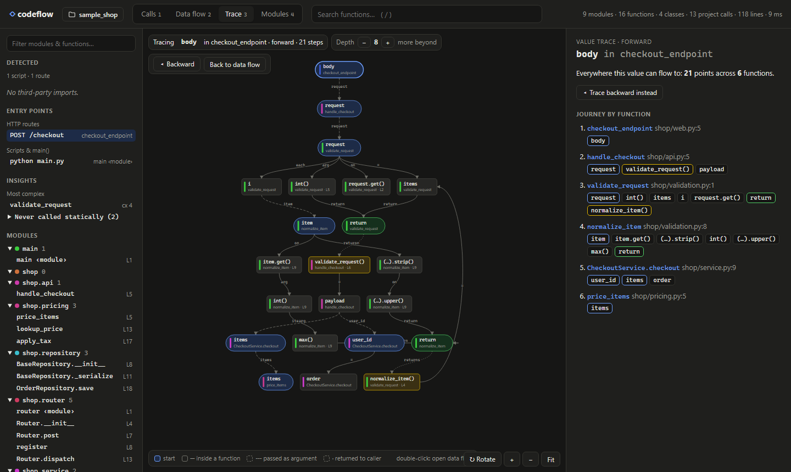
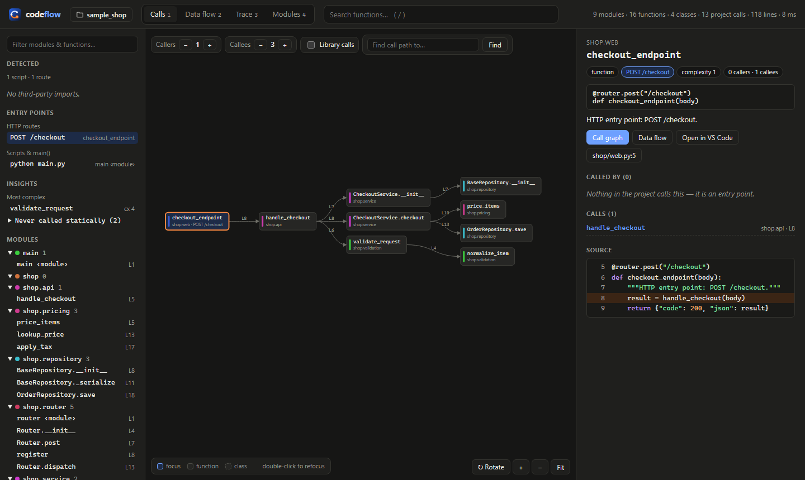
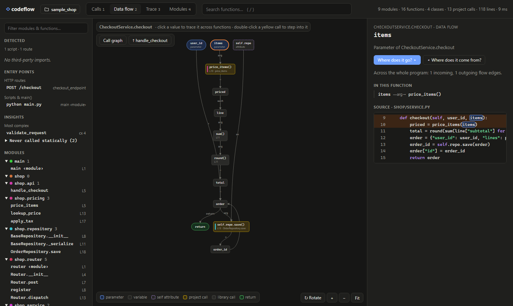
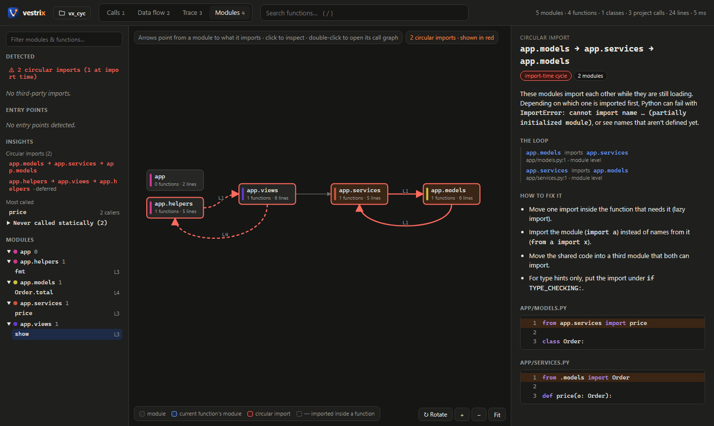
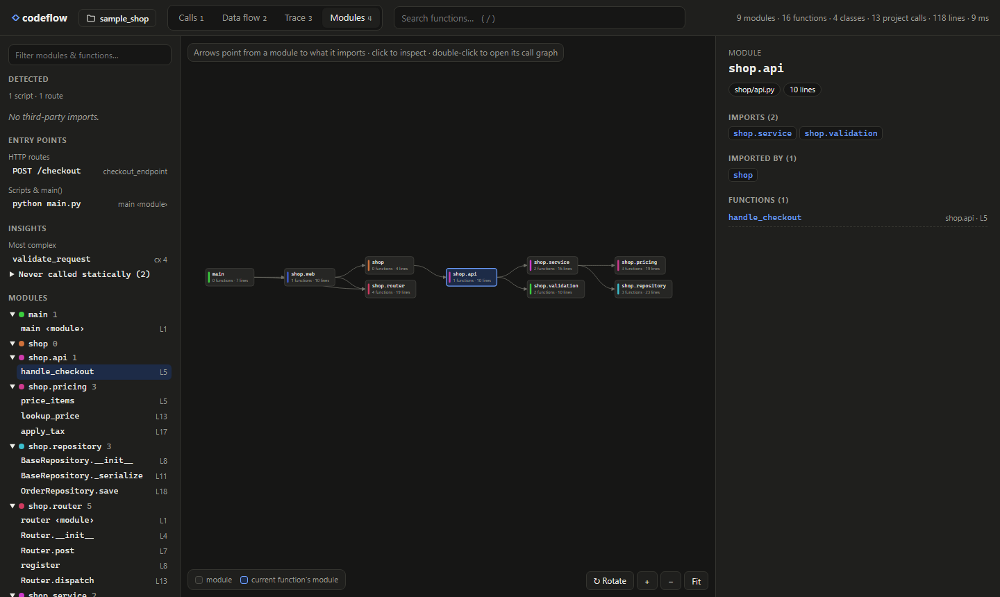
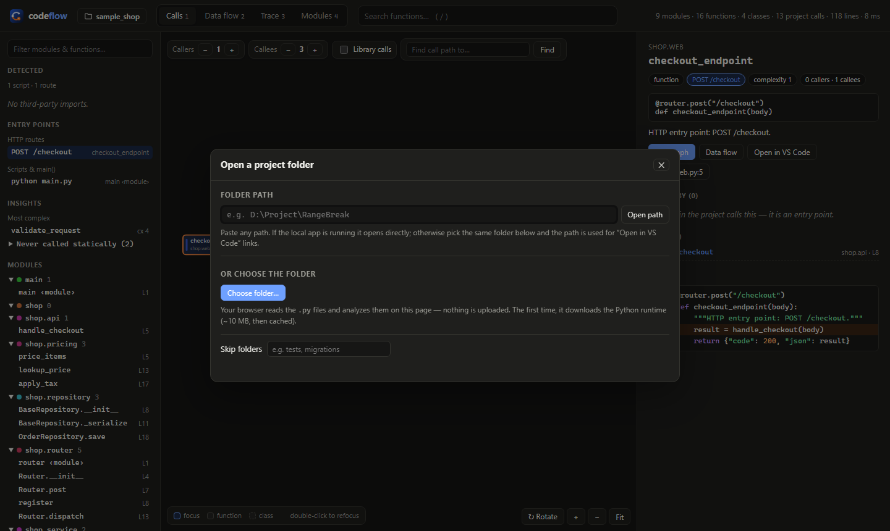

<p align="center">
  <picture>
    <source media="(prefers-color-scheme: dark)" srcset="docs/brand/logo-dark.svg">
    
  </picture>
</p>

<p align="center"><b>AI wrote it. See how it flows.</b><br>
Interactive call graphs and data-flow tracing for Python: offline, zero dependencies, and nothing leaves your machine.</p>

<p align="center">
  <a href="https://github.com/Tejas-Sinroja/Vestrix/actions/workflows/ci.yml"></a>
  <a href="https://github.com/Tejas-Sinroja/Vestrix/releases"></a>
  
  
  <a href="LICENSE"></a>
</p>

---

## Why Vestrix

Code gets written faster than ever. With vibe coding, an assistant can write a whole feature in minutes. Reading it is still slow.
When you accept code you never traced by hand, you pick up **comprehension debt**: the program works, but nobody holds
a mental model of *what calls what* or *where a value ends up*. That debt comes due the first time you have to debug it,
review it, secure it, or change it.

Vestrix pays that debt down visually. Point it at any Python folder, whether it's your own code, an AI-generated feature,
or a repo you just cloned, and in about a second you can answer:

- **"What happens when this endpoint is hit?"** Follow the call graph from any route, script or CLI command.
- **"Where does this value go?"** Click `request.body` and watch it travel through every function it reaches.
- **"Where did this come from?"** Trace a value backwards to its sources.
- **"What did the AI actually pull in?"** See detected frameworks, entry points, and functions nothing calls.
- **"Why does this crash on import?"** Find **circular imports**, with the exact `file:line` of each import in the loop
  and how to break it.

It reads code with Python's own `ast` module and never runs it, so it's safe to use on code you don't trust yet.



## What you get

Four linked views:

| View | Answers | How to use |
|---|---|---|
| **Calls** | "When this runs, what else runs? Who calls it?" | Adjust caller/callee depth, toggle library calls, **find the call path** between two functions |
| **Data flow** | "Inside this function, where does each value come from and go?" | Params → variables → calls → return. Double-click a yellow call to step into it |
| **Trace** | "If I change this value, what does it affect across the whole program?" | Click any value in Data flow → *Where does it go?* / *Where does it come from?* |
| **Modules** | "How are the files wired together? Is anything circular?" | Import graph with circular imports in red; click a module or cycle for details |

The side panel shows the signature, docstring, callers, callees, library calls, complexity, and **highlighted source**,
plus an *Open in VS Code* link. The sidebar lists detected **entry points** (HTTP routes, `__main__` scripts, CLI commands,
Celery-style tasks, tests) and **insights** (most-called, most-complex, never-called functions).

## Screenshots

All screenshots use the bundled demo app in [`examples/sample_shop`](examples/sample_shop). Open
[`examples/sample_shop.html`](examples/sample_shop.html) to try it yourself.

### Calls: what runs when this runs

Starting from the `POST /checkout` route, you can see every function it reaches, grouped by module and labelled with
the line each call happens on. The panel on the right shows the source with the call lines highlighted.



### Data flow: how values move inside a function

This is `CheckoutService.checkout`: parameters (blue) → variables → calls (yellow = project code) → `return` (green).
Selecting `items` highlights every line where it's used.



### Trace: follow one value across the whole program

This traces the HTTP request `body` forward. It becomes `request` in `handle_checkout`, is validated and normalised,
then turns into `items` in the service and in `price_items`. The right side lists the journey function by function.


### Circular imports: catch the crash before it happens

Vestrix separates **import-time** cycles, which can fail with `ImportError: … partially initialized module`, from
**deferred** cycles that only close through an import inside a function. Deferred cycles work, but they're fragile.
Imports under `if TYPE_CHECKING:` are ignored. Each cycle shows the loop, the `file:line` of every import, and ways to fix it.



In CI, `vestrix cycles .` exits with code 1 when it finds an import-time cycle:

```bash
python -m vestrix cycles .
# IMPORT-TIME CYCLE: app.models -> app.services -> app.models
#     app/models.py:1    app.models imports app.services   [top]
#     app/services.py:1  app.services imports app.models   [top]
```

### Modules: how the files are wired

This is the import graph between modules. Click a module to see what it imports, what imports it, and what it contains.



### Open any folder

Paste a path, or choose a folder. A plain HTML file can analyze the folder right in the browser; the local app
(`vestrix.bat`) adds a folder browser that shows what each folder contains.



## Quick start

```bash
git clone https://github.com/Tejas-Sinroja/Vestrix && cd Vestrix
python -m vestrix ui                                      # opens the app with a folder picker
python -m vestrix ui D:\Project\RangeBreak                # or start with a folder
python -m vestrix build path/to/your/repo -o flow.html --open   # one offline file to share
```

**Easiest on Windows:** double-click `vestrix.bat` (or drag a project folder onto it). It starts the app on
`http://127.0.0.1:8347` (and moves to the next port if that one is busy), then opens your browser.

### Choosing a folder

Click the folder button in the header (or press `O`). It works in both kinds of page:

**Opened as an HTML file** (for example `examples/sample_shop.html`):

- **Choose folder…**: pick any folder. The browser reads the `.py` files and runs the same analyzer on the page
  (Python compiled to WebAssembly, using Pyodide). Nothing is uploaded. The first time, it downloads the ~10 MB runtime,
  which is then cached. Needs Edge, Chrome or another Chromium browser; Firefox uses the upload-style folder picker.
- **Folder path**: paste a path such as `D:\Project\RangeBreak`. If the local app is running, the page opens that path
  in the app. If it isn't, the path is kept for "Open in VS Code" links when you choose the folder.

**Running the local app** (`vestrix.bat` / `python -m vestrix ui`), the picker lets you:

- type or paste a path, or use **Browse…** for the normal Windows folder dialog
- browse drives, Home, the current directory, and **recently opened** projects
- see what's in each folder before you open it: `.py` count and markers like `git`, `pyproject`, `requirements`,
  `uv`, `poetry`, `django`, `docker`, `package`
- skip extra folders (for example `tests, migrations`); `.venv`, `__pycache__`, `node_modules`, etc. are always skipped

After a folder is analyzed, the **Detected** section in the sidebar lists the frameworks and libraries it uses
(FastAPI, pandas, pytest, Pydantic, …) and counts its entry points. Click a library to see which modules and functions use it.
The server re-analyzes on every page refresh, so code changes show up immediately. Analysis only reads files; it never writes into the project.

Other commands:

```bash
python -m vestrix list  <repo> --entries                   # entry points
python -m vestrix trace <repo> checkout_endpoint body      # follow a value in the terminal
python -m vestrix trace <repo> apply_tax amount --back     # where does it come from?
python -m vestrix cycles <repo>                            # circular imports (exit 1 on import-time cycles)
python -m vestrix json  <repo> -o graph.json               # raw graph for other tools
```

Or install it as a command: `pip install -e .` then `vestrix serve .`

No dependencies (stdlib only, Python 3.8+). The HTML is fully self-contained and works offline.

### Keyboard

`O` open folder · `/` search · `1`–`4` switch view · `F` fit · `R` rotate layout · `+`/`-` zoom · `Esc` clear · drag to pan · wheel to zoom ·
hover a node to highlight its connections · double-click to refocus. The URL hash keeps your place, so links are shareable.

## How it works

```
.py files ──ast──▶ per-function facts ──resolve──▶ call graph ──bind args→params──▶ global value-flow graph ──▶ viewer
```

1. **Parse** each file with `ast` (code is never executed).
2. **Extract** per function: params, calls (with each argument's sources), local def→use edges, decorators, docstring, complexity.
3. **Resolve** every call to a project function: local defs, imports / relative imports / package re-exports,
   `self.method` with **inheritance**, `super()`, simple type inference (`x = Cls(); x.m()`, `self.repo = Repo()` in `__init__`,
   module-level instances like `router = Router()`).
4. **Stitch** data flow across functions: argument → callee parameter, callee `return` → caller, and `self.<attr>` shared by all
   methods of a class. That global graph powers **Trace**.

## Versioning & releases

Vestrix uses [Semantic Versioning](https://semver.org/) with tags named `vX.Y.Z`. Every tag becomes a
[GitHub Release](https://github.com/Tejas-Sinroja/Vestrix/releases) with a wheel, an sdist and a demo page, built
automatically. See [CHANGELOG.md](CHANGELOG.md) for what changed and [RELEASING.md](RELEASING.md) for the release cycle.

```bash
pip install "git+https://github.com/Tejas-Sinroja/Vestrix@v0.3.0"   # a specific release
vestrix ui
```

## License

Source-available under the [PolyForm Noncommercial License 1.0.0](LICENSE):

- **Free** for personal, hobby, learning and research use, and for schools, charities, public research and government.
- **Commercial use needs a paid license.** That includes using it at work on company code. See [COMMERCIAL.md](COMMERCIAL.md)
  for what counts as commercial and how to get a license.

Contributions are welcome under the terms in [CONTRIBUTING.md](CONTRIBUTING.md).

## Brand

The logo files are in [`docs/brand`](docs/brand): `mark.svg` (app icon / favicon), `logo-light.svg` and `logo-dark.svg`
(wordmark), and `banner.svg` / `social-preview.png` (1280×640, for the repository's social preview). The mark is a
"V" drawn as a flow path. A value enters the code (the light stroke), reaches a call (the vertex), and its traced path
comes back out (orange, the same highlight the app uses). The name comes from Latin *vestigium*, "trace, footprint",
which is also the root of *investigate*.

## Project layout

```
vestrix/
  analyzer.py   static analysis engine (Project, trace, JSON export)
  render.py     embeds the analysis into viewer.html
  viewer.html   the interactive app (vanilla JS + SVG, layered graph layout, no CDN)
  server.py     local server: live re-analysis, folder browser, native folder dialog
  cli.py        ui / build / serve / list / trace / json
examples/sample_shop/   runnable demo app (route → service → pricing → repository)
tests/                  python -m unittest discover -s tests
```

## Known limits

Static analysis over-approximates in some places and misses dynamic behaviour:
calls through variables holding functions (`handler(body)`), `getattr`, dependency-injection containers,
and decorators that replace functions are not followed. Data flow is flow-insensitive (it ignores branch order).

## Roadmap

1. **Runtime overlay** — record real calls and values with `sys.monitoring` (3.12+) / `sys.settrace` while tests run, and paint what *actually* happened on top of the static graph.
2. **Framework adapters** — FastAPI/Flask/Django route tables, dependency injection, Celery, SQLAlchemy models as data sinks.
3. **Diff mode** — compare two commits: which call paths and data flows a PR changes.
4. **Editor integration** — VS Code extension that opens the viewer beside the code and syncs selection.
5. **Explanations** — LLM summaries of a function or a traced path; more languages via tree-sitter.
